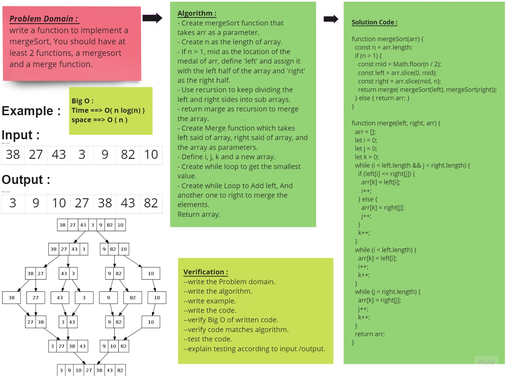
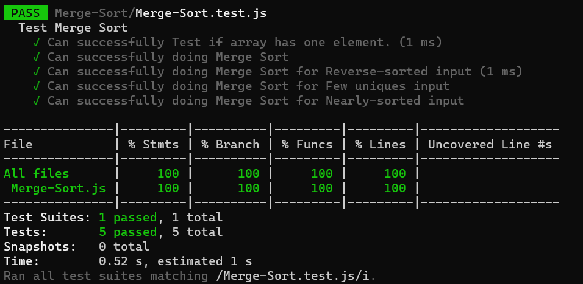

# Merge Sort
<!-- Description of the challenge -->
Trace the algorithm by stepping through the process with the provided sample array. Document your explanation by creating a blog article that shows the step-by-step output after each iteration through some sort of visual.

Once you are done with your article, code a working, tested implementation of Merge Sort based on the pseudocode provided.

## Whiteboard Process
<!-- Embedded whiteboard image -->

## Approach & Efficiency
<!-- What approach did you take? Why? What is the Big O space/time for this approach? -->
- Understand the problem first.
- Write the code.
- Make the tests.
The Big O for this approach is :

- Time : O( n log(n) ). ==> Because merge sort always divides the array in two halves and takes linear time to merge two halves.
- Space : O( n ). ==> Because we need to create new sub arrays to store elements.

## Solution
<!-- Show how to run your code, and examples of it in action -->
All Tests is passed :

