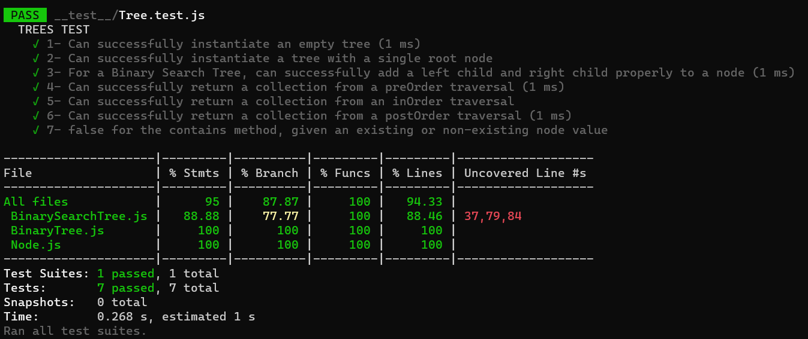

# Trees

<!-- Short summary or background information -->

Common Terminology :

- Node - A Tree node is a component which may contain its own values, and references to other nodes
- Root - The root is the node at the beginning of the tree
- K - A number that specifies the maximum number of children any node may have in a k-ary tree. In a binary tree, k = 2.
- Left - A reference to one child node, in a binary tree
- Right - A reference to the other child node, in a binary tree
- Edge - The edge in a tree is the link between a parent and child node
- Leaf - A leaf is a node that does not have any children
- Height - The height of a tree is the number of edges from the root to the furthest leaf

## Challenge

<!-- Description of the challenge -->

Code Challenge: Class 15: Binary Tree and Binary Search Tree(BST).

### Node :

Create a Node class that has properties for the value stored in the node, the left child node, and the right child node.

### Binary Tree :

Create a Binary Tree class
Define a method for each of the depth first traversals:

- pre order
- in order
- post order which returns an array of the values, ordered appropriately.

### Binary Search Tree :

Create a Binary Search Tree class

This class should be a sub-class (or your languages equivalent) of the Binary Tree Class, with the following additional methods:

- Add
  - Arguments: value
  - Return: nothing
  - Adds a new node with that value in the correct location in the binary search tree.
- Contains
  - Argument: value
  - Returns: boolean indicating whether or not the value is in the tree at least once.

## Approach & Efficiency

<!-- What approach did you take? Why? What is the Big O space/time for this approach? -->

- Understand the problem first.
- Write the code.
- Make the tests.

The Big O for this approach is : we didn't use any loop then :

- Binary Tree : preOrder(), inOrder(), postOrder().

  - Time : O(n).
  - Space : O(n).

  Because traversing through nodes needs to keep tacking of the last visited node.

- Binary Search Tree : add(value) and contains(value).

  - Time : O(log(n)).
  - Space : O(log(n)).

  Because inserting and searching in a Binary Search Tree depends on the tree's height which equals to log(n).

## API

<!-- Description of each method publicly available in each of your trees -->

- Binary Tree :
  - `preOrder()`: Traverse a tree >> root - left - right.
  - `inOrder()`: Traverse a tree >> left - root - right.
  - `postOrder()`: Traverse a tree >> left - right - root.
- Binary Search Tree :
  - `add(value)`: Add a node in the correct location in the binary search tree.
  - `contains(value)`: Check whether or not the value is in the binary search tree at least once.

### All Test is passed :

