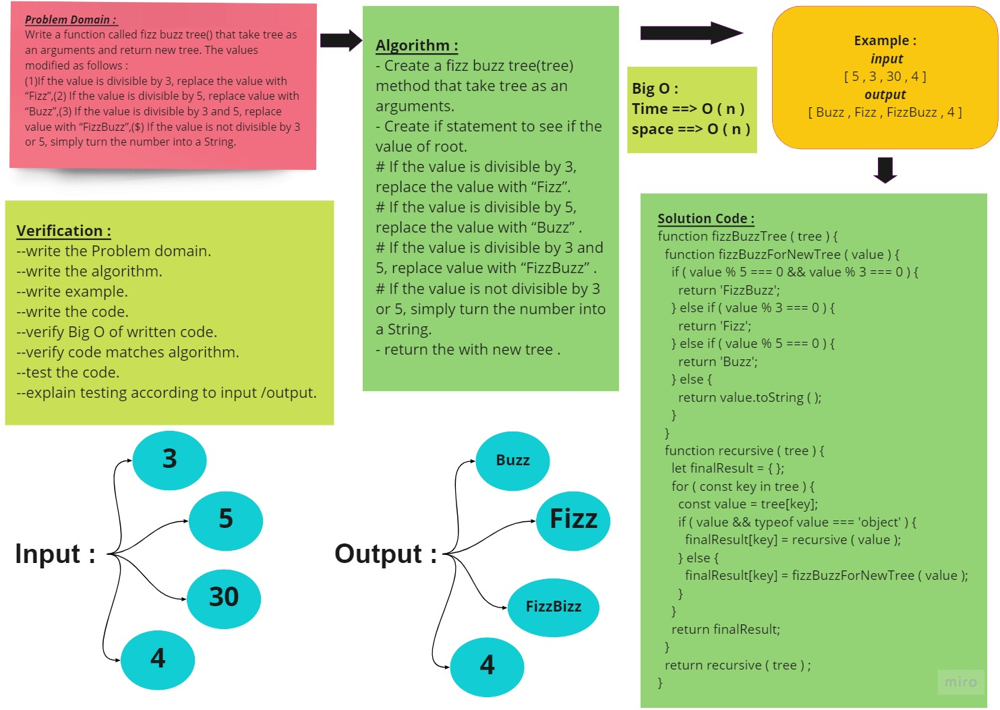
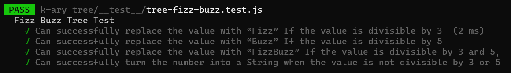

# Find the Maximum Value in a Binary Tree

<!-- Description of the challenge -->

Conduct “FizzBuzz” on a k-ary tree while traversing through it to create a new tree.

Set the values of each of the new nodes depending on the corresponding node value in the source tree.

Write a function called fizz buzz tree :

- Arguments: k-ary tree
- Return: new k-ary tree

Determine whether or not the value of each node is divisible by 3, 5 or both. Create a new tree with the same structure as the original, but the values modified as follows:

- If the value is divisible by 3, replace the value with “Fizz”
- If the value is divisible by 5, replace the value with “Buzz”
- If the value is divisible by 3 and 5, replace the value with “FizzBuzz”
- If the value is not divisible by 3 or 5, simply turn the number into a String.

## Whiteboard Process

<!-- Embedded whiteboard image -->

## Approach & Efficiency

<!-- What approach did you take? Why? What is the Big O space/time for this approach? -->

- Understand the problem first.
- Write the code.
- Make the tests.

The Big O for this approach is :

- Time : O(n).
- Space : O(n).

## Solution

<!-- Show how to run your code, and examples of it in action -->

### All Test is passed :

