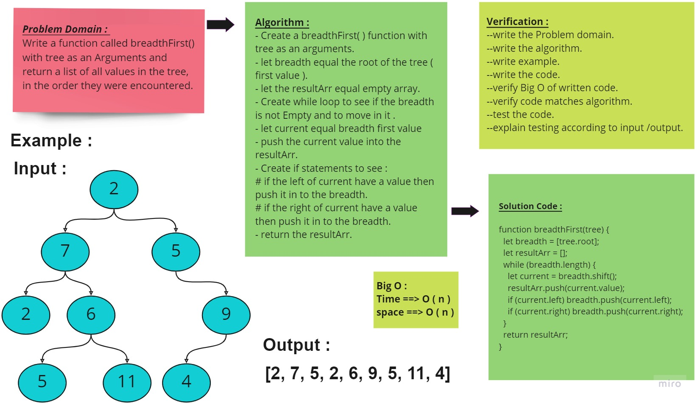
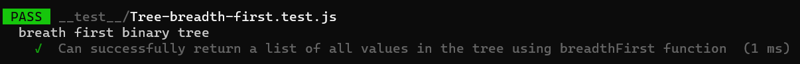

# Breadth-first Traversal.

<!-- Description of the challenge -->

- Write a function called breadth first
- Arguments: tree
- Return: list of all values in the tree, in the order they were encountered

  > NOTE: Traverse the input tree using a Breadth-first approach

## Whiteboard Process

<!-- Embedded whiteboard image -->

## Approach & Efficiency

<!-- What approach did you take? Why? What is the Big O space/time for this approach? -->

- Understand the problem first.
- Write the code.
- Make the tests.

The Big O for this approach is :

- Time : O(n).
- Space : O(n).

## Solution

<!-- Show how to run your code, and examples of it in action -->

### All Test is passed :

