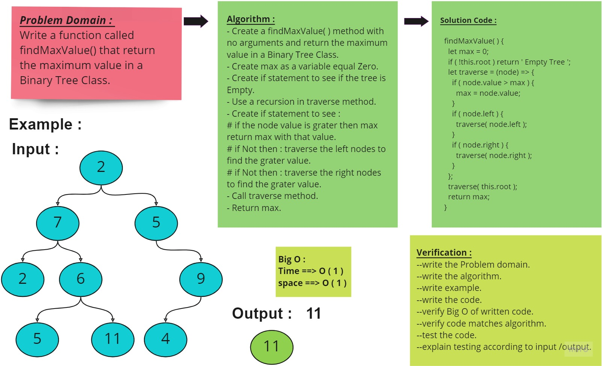
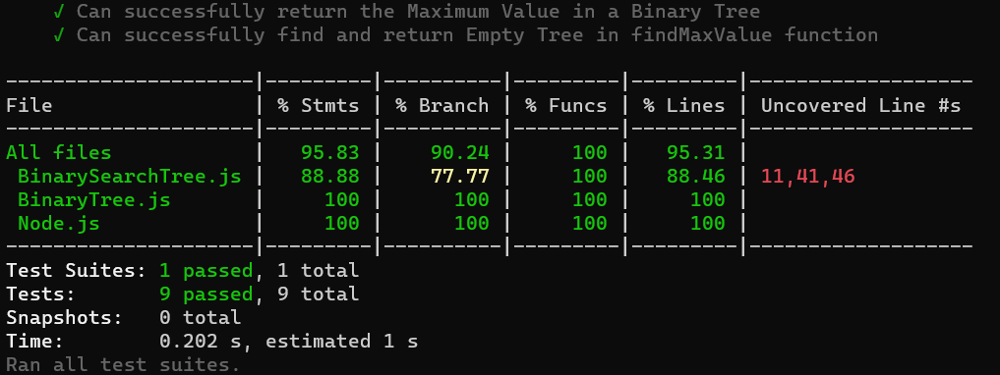

# Find the Maximum Value in a Binary Tree

<!-- Description of the challenge -->

Write the following method for the Binary Tree class :

- find maximum value
  - Arguments: none
  - Returns: number
- Find the maximum value stored in the tree. You can assume that the values stored in the Binary Tree will be numeric.

## Whiteboard Process

<!-- Embedded whiteboard image -->

## Approach & Efficiency

<!-- What approach did you take? Why? What is the Big O space/time for this approach? -->

- Understand the problem first.
- Write the code.
- Make the tests.

The Big O for this approach is : we didn't use any loop then :

- Time : O(1).
- Space : O(1).

## Solution

<!-- Show how to run your code, and examples of it in action -->

### All Test is passed :

