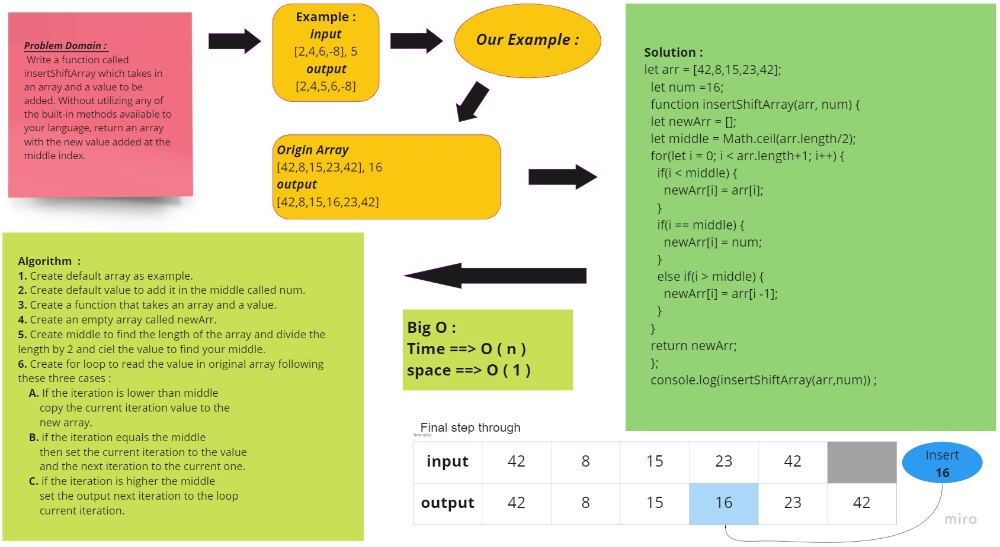

# Insert to Middle of an Array
<!-- Description of the challenge -->
 Write a function called insertShiftArray which takes in an array and a value to be added. Without utilizing any of the built-in methods available to your language, return an array with the new value added at the middle index.

## Whiteboard Process
<!-- Embedded whiteboard image -->

-Open image :
[array-insert-shift image](../assets/insert-Shift-Array.jpg)

-Open pull request :
[array-insert-shift image](https://github.com/SohaibAlmomani/data-structures-and-algorithms/pulls?q=is%3Apr+is%3Aclosed)

## Approach & Efficiency
<!-- What approach did you take? Discuss Why. What is the Big O space/time for this approach? -->
