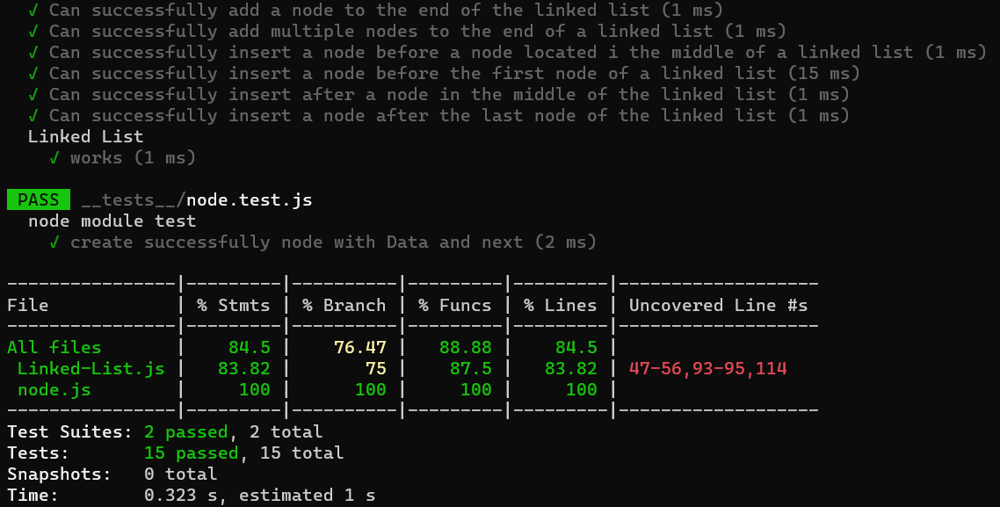

# Linked-List Insertions

## Challenge :

<!-- Description of the challenge -->

Write the following methods for the Linked List class:

append :

- arguments : new data
- adds a new node with the given data to the end of the list

insert before :

- arguments: data, new data
- adds a new node with the given new data immediately before the first node that has the data specified

insert after :

- arguments: data, new data
- adds a new node with the given new data immediately after the first node that has the data specified

## Whiteboard Process

<!-- Embedded whiteboard image -->
### Append method :

## Approach & Efficiency

<!-- What approach did you take? Why? What is the Big O space/time for this approach? -->

Create Class LinkedLest that have three main functions :

- append().
- insertBefore().
- insertAfter().

The Big O for this approach is :

- Time : O(n).
- Space : O(1).

## Solution

<!-- Show how to run your code, and examples of it in action -->

### Test :

Write tests to prove the following functionality:

- Can successfully add a node to the end of the linked list
- Can successfully add multiple nodes to the end of a linked list
- Can successfully insert a node before a node located i the middle of a linked list
- Can successfully insert a node before the first node of a linked list
- Can successfully insert after a node in the middle of the linked list
- Can successfully insert a node after the last node of the linked list

