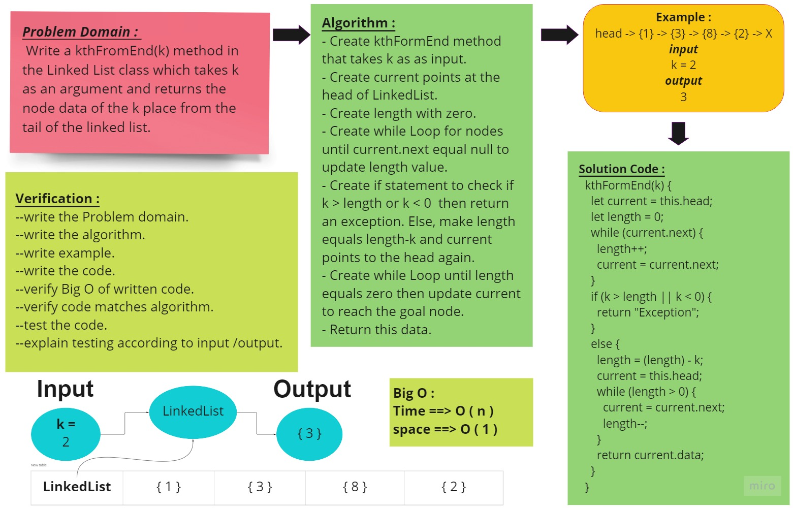
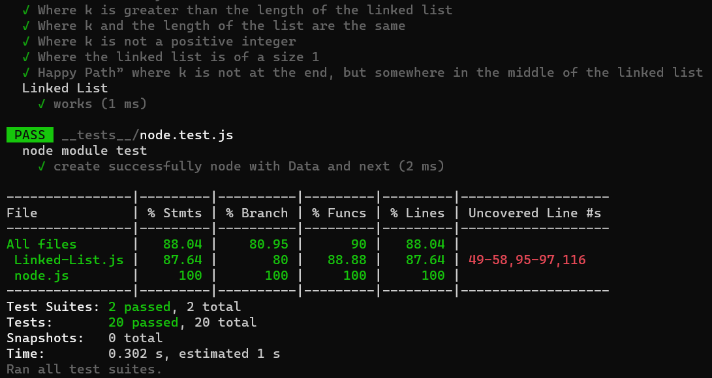

# linked-list-kth

## Challenge

<!-- Description of the challenge -->

Write the following method for the Linked List class:

kth from end :

- argument: a number, k, as a parameter.
- Return the node’s value that is k places from the tail of the linked list.
- You have access to the Node class and all the properties on the Linked List class as well as the methods created in previous challenges.

## Whiteboard Process

<!-- Embedded whiteboard image -->

## Approach & Efficiency

<!-- What approach did you take? Why? What is the Big O space/time for this approach? -->

Create Class LinkedLest that have linked-list-kth method

The Big O for this approach is :

- Time : O(n).
- Space : O(1).

## Solution

<!-- Show how to run your code, and examples of it in action -->

### Test :

Write tests for the following scenarios, and any other cases that help you ensure your code is working as expected :

1. Where k is greater than the length of the linked list
2. Where k and the length of the list are the same
3. Where k is not a positive integer
4. Where the linked list is of a size 1
5. “Happy Path” where k is not at the end, but somewhere in the middle of the linked list

