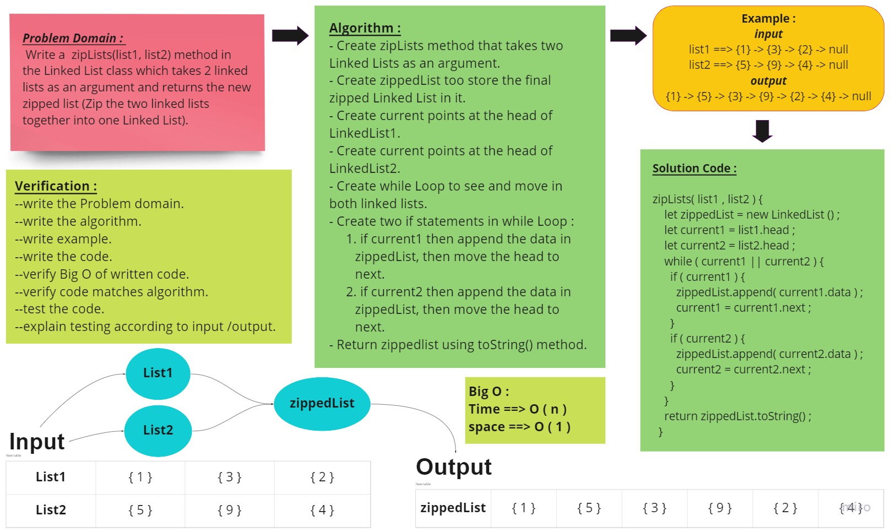
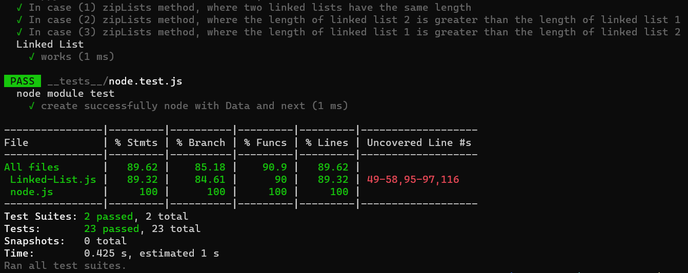

# linked-list-zip

## Challenge

<!-- Description of the challenge -->

Write the following method for the Linked List class:

linked-list-zip :

- Write a function called zip lists
- Arguments: 2 linked lists
- Return: New Linked List, zipped as noted below
- Zip the two linked lists together into one so that the nodes alternate between the two lists and return a reference to the the zipped list.
- Try and keep additional space down to O(1)
- You have access to the Node class and all the properties on the Linked List class as well as the methods created in previous challenges.

## Whiteboard Process

<!-- Embedded whiteboard image -->

## Approach & Efficiency

<!-- What approach did you take? Why? What is the Big O space/time for this approach? -->

Create Class LinkedLest that have zipLists method .

The Big O for this approach is :

- Time : O(n).
- Space : O(1).

## Solution

<!-- Show how to run your code, and examples of it in action -->

### Test :

write tests for any cases that help you ensure your code is working as expected. Think through different edge cases to determine what tests will ensure your code is covered :

1. In case (1) zipLists method, where two linked lists have the same length
2. In case (2) zipLists method, where the length of linked list 2 is greater than the length of linked list 1
3. In case (3) zipLists method, where the length of linked list 1 is greater than the length of linked list 2

