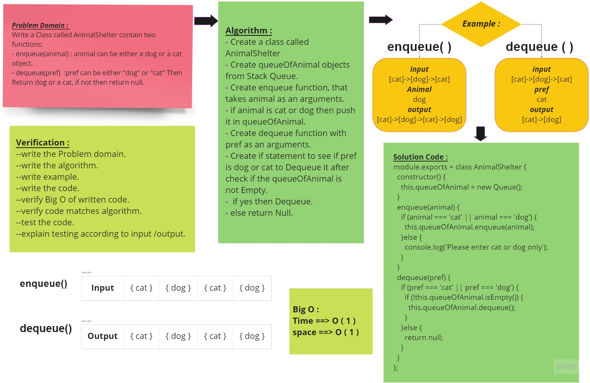
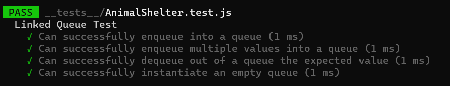

# Challenge Summary

<!-- Description of the challenge -->

Create a class called AnimalShelter which holds only dogs and cats.

The shelter operates using a first-in, first-out approach.

Implement the following methods:

- enqueue
  - Arguments: animal
    - animal can be either a dog or a cat object.
- dequeue
  - Arguments: pref
    - pref can be either "dog" or "cat"
  - Return: either a dog or a cat, based on preference.
    - If pref is not "dog" or "cat" then return null.

## Whiteboard Process

<!-- Embedded whiteboard image -->

## Approach & Efficiency

<!-- What approach did you take? Why? What is the Big O space/time for this approach? -->
- Understand the problem first.
- Write the code.
- Make the tests.

The Big O for this approach is :
we didn't use any loop then :

- Time : O(1).
- Space : O(1).

## Solution

<!-- Show how to run your code, and examples of it in action -->
### All Test is passed :

