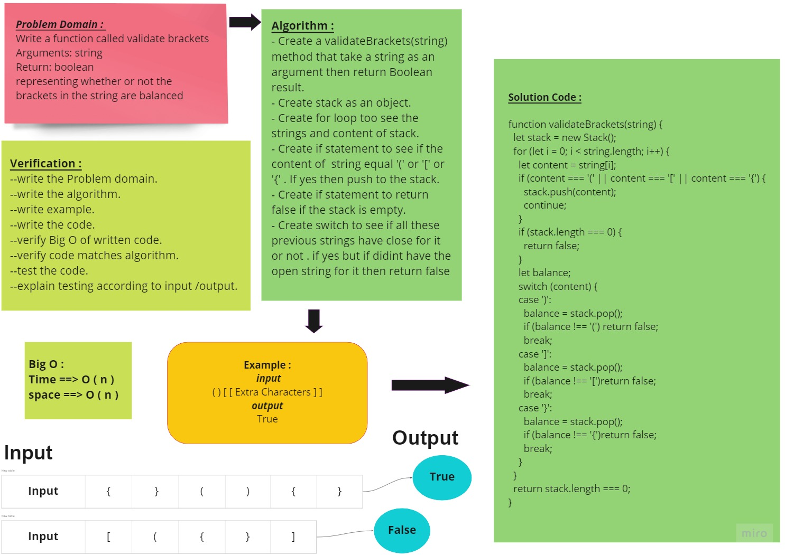
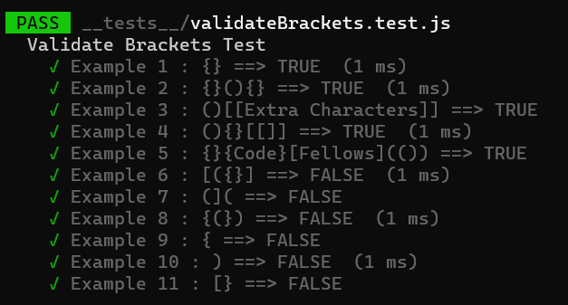

# Challenge Summary

<!-- Description of the challenge -->

Write a function called validate brackets

- Arguments: string
- Return: boolean
  - representing whether or not the brackets in the string are balanced

## Whiteboard Process

<!-- Embedded whiteboard image -->

## Approach & Efficiency

<!-- What approach did you take? Why? What is the Big O space/time for this approach? -->
- Understand the problem first.
- Write the code.
- Make the tests.

The Big O for this approach is :

- Time : O(n).
- Space : O(n).

## Solution

<!-- Show how to run your code, and examples of it in action -->

