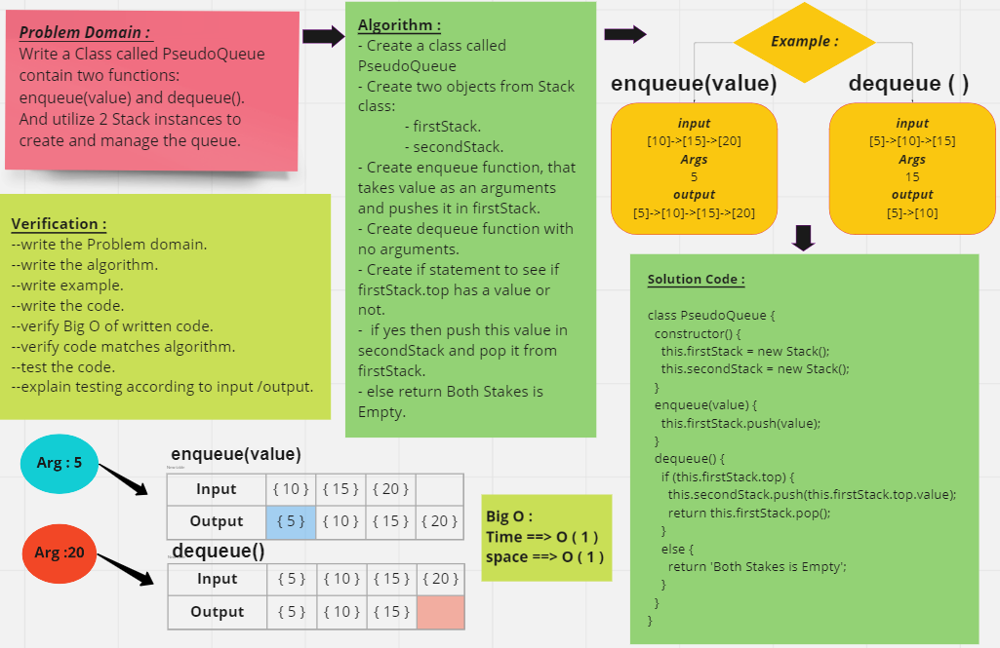
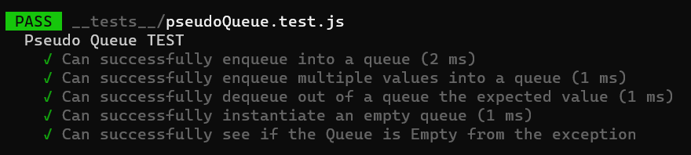

# Challenge Summary

<!-- Description of the challenge -->

- Create a new class called pseudo queue.
  - Instead, this PseudoQueue class will implement our standard queue interface (the two methods listed below),
  - Internally, utilize 2 Stack instances to create and manage the queue
- Methods:

  1. enqueue

     - Arguments: value
     - Inserts value into the PseudoQueue, using a first-in, first-out approach.

  2. dequeue

     - Arguments: none
     - Extracts a value from the PseudoQueue, using a first-in, first-out approach.

## Whiteboard Process

<!-- Embedded whiteboard image -->

## Approach & Efficiency

<!-- What approach did you take? Why? What is the Big O space/time for this approach? -->

- Understand the problem first.
- Write the code.
- Make the tests.

The Big O for this approach is :
we didn't use any loop then :

- Time : O(1).
- Space : O(1).

## Solution

<!-- Show how to run your code, and examples of it in action -->

### All Test is passed :

